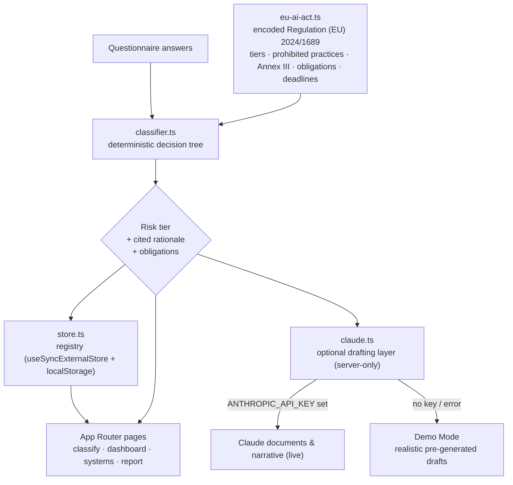

<div align="center">


# Conforma

### EU AI Act compliance, automated.

Turn **Regulation (EU) 2024/1689** into a guided workflow — inventory your AI systems,
auto-classify their risk tier with citations to the exact Articles, close the
obligations that apply, and generate the documentation regulators expect.

[](https://github.com/elkamohammad1988/conforma/actions/workflows/ci.yml)
[](https://github.com/elkamohammad1988/conforma/actions/workflows/codeql.yml)
[](LICENSE)
[](https://nextjs.org/)
[](https://react.dev/)
[](https://www.typescriptlang.org/)
[](https://tailwindcss.com/)
[](CONTRIBUTING.md)

<br/>

**▶ [Live demo](https://conforma-ten.vercel.app)** &nbsp;·&nbsp; runs in **Demo Mode** — no sign-up, no API key, no backend
<br/>
**▶ [Watch the 80-second product tour](docs/portfolio/conforma-demo.mp4)** &nbsp;·&nbsp; recorded end-to-end from the live app
<br/>
<sub>Deployed on Vercel · <a href="https://conforma-ten.vercel.app">conforma-ten.vercel.app</a></sub>

<br/>

<a href="docs/portfolio/conforma-demo.mp4" title="Watch the product tour (MP4)"></a>

</div>

---

## Table of contents

- [Overview](#overview)
- [Screenshots](#screenshots)
- [Features](#features)
- [Architecture](#architecture)
- [Tech stack](#tech-stack)
- [Installation](#installation)
- [Environment variables](#environment-variables)
- [Usage](#usage)
- [Folder structure](#folder-structure)
- [Roadmap](#roadmap)
- [Contributing](#contributing)
- [License](#license)
- [Disclaimer](#disclaimer)
- [Contact](#contact)

---

## Overview

Every organisation now ships AI, and the EU AI Act reaches any AI that touches the
EU market — wherever the company is based, much like the GDPR. Yet "compliance"
today usually means a lawyer, a spreadsheet, and weeks cross-referencing a
100-page regulation, all against the **2 August 2026** deadline for high-risk
systems.

**Conforma encodes the regulation as typed, citable logic and puts a product on
top of it.** Answer a short questionnaire per system and you get a defensible risk
classification — every conclusion traceable to a specific Article or Annex — the
exact obligations that apply, a live countdown to your deadline, and first-draft
regulatory documents.

> [!NOTE]
> Conforma is **dual-mode by design.** Out of the box it runs in **Demo Mode** —
> the registry lives in the browser, so the whole product is explorable with
> **zero credentials** (that is exactly what the
> [live demo](https://conforma-ten.vercel.app) serves). Set the Supabase env vars
> and the *same codebase* switches to **Production Mode**: real Postgres with
> row-level security, authentication, organizations, per-tenant isolation and
> Stripe billing — no rewrite, one flag. It is decision-support tooling, **not
> legal advice** — see the [Disclaimer](#disclaimer).

📂 **Portfolio:** read the full **[case study](docs/case-study.md)**, follow the
**[90-second demo script](docs/demo-script.md)**, or dive into the
**[architecture write-up](docs/architecture.md)** and the
**[decision records](docs/adr/)**. See also the **[API reference](docs/api.md)**,
the **[security model](docs/security.md)** and the
**[accessibility statement](docs/accessibility.md)**.

### Why it stands out

- **Cited, not vibes.** Risk tiers come from a deterministic decision tree mapped
  directly to the Act's text — every result links to the Article that drives it.
- **Works offline, scales online.** The core engine needs no API key. When an
  `ANTHROPIC_API_KEY` is absent the app drops into **Demo Mode** — realistic,
  system-specific pre-generated AI documents — so the public repo and the Vercel
  deployment are fully functional, and premium, with zero paid credentials.
- **One source of truth.** The entire regulation lives in a single typed module
  ([`eu-ai-act.ts`](src/lib/eu-ai-act.ts)) that the classifier, the obligation
  checklist and the document generator all read from.
- **Demo-simple, production-real.** The *same* app runs credential-free on
  `localStorage` **and** as a multi-tenant SaaS on Supabase — Postgres with
  row-level security, auth, organizations and Stripe billing — selected entirely
  by environment. The persistence seam ([`store.ts`](src/lib/store.ts)) is a real
  interface, not a stub, so switching modes is configuration, not a rewrite.

---

## Screenshots

| Guided risk classifier | AI system registry (dashboard) |
| :---: | :---: |
|  |  |
| **System detail — rationale, obligations & AI docs** | **Audit-ready readiness report** |
|  |  |
| **Transparent pricing** | **Security &amp; trust** |
|  |  |
| **Marketing landing** | **Mobile (responsive)** |
|  |  |

> Every shot above is a fresh 2× retina capture of the **live production
> deployment**, regenerated with `npm run screenshots` (Playwright drives your
> installed Chrome/Edge — no browser download). The **[80-second product
> tour](docs/portfolio/conforma-demo.mp4)** is recorded the same way with
> `npm run demo:video`, and a narrated walkthrough lives in
> **[docs/demo-script.md](docs/demo-script.md)**.

---

## Features

- 🧭 **Guided risk classification** — a five-step questionnaire maps each system to
  one of the four EU AI Act risk tiers (prohibited · high · limited · minimal).
- 📑 **Article-level citations** — every classification and obligation references the
  specific Article or Annex of Regulation (EU) 2024/1689, so it is defensible in an
  audit.
- ✅ **Obligation tracking** — a per-system checklist of the exact Chapter III / Art. 50
  duties, split by your role (provider vs deployer), with To do → In progress → Done.
- 📂 **AI system registry** — a portfolio dashboard with risk distribution, average
  compliance, and the nearest deadline across every system.
- 🤖 **AI-drafted documents** — generate the Annex IV technical file, Art. 50
  transparency notice and the EU declaration of conformity, tailored per system
  (powered by Claude when configured; realistic Demo Mode drafts otherwise, with a
  clear in-app indicator).
- ⏳ **Live deadline countdowns** — to each phased application date from Art. 113.
- 🧠 **GPAI aware** — flags general-purpose AI model obligations (Art. 53+) on top of
  the system-level tier.
- 🧾 **Printable readiness report** — an executive summary you can export to PDF.
- 🔍 **SEO & social ready** — metadata, Open Graph image, JSON-LD, `robots.txt` and
  `sitemap.xml` out of the box.

### Production Mode — a full multi-tenant SaaS layer

The same codebase, activated by adding Supabase (and, optionally, Stripe) env vars:

- 🔐 **Authentication & multi-tenancy** — email auth, organizations, `owner` /
  `admin` / `member` roles, and team invitations (transactional email **and** a
  shareable accept link).
- 🛡️ **Postgres + Row-Level Security** — per-tenant data isolation enforced at the
  database, not just the app: **8 migrations, 40+ RLS policies**.
- 💳 **Stripe billing** — Free / Pro / Team plans, checkout, customer portal and
  signature-verified webhooks driving plan state, with server-side seat and usage
  limits.
- 🧾 **Audit trail** — every privileged mutation (invites, role changes, billing)
  is recorded per organization.
- 🔑 **Public REST API** — `/api/v1/systems` and `/api/v1/documents`, authenticated
  with **hashed** API keys (only the hash is ever stored).

> One flag flips it back: `NEXT_PUBLIC_DEMO=1` forces Demo Mode even with Supabase
> configured — how the public portfolio deploy stays sign-up-free while the whole
> production architecture remains wired.

---

## Architecture

Conforma's design principle is a **single, typed source of truth** for the
regulation, consumed by a deterministic engine, with AI strictly layered on top —
never able to override a cited legal conclusion.



**Key decisions**

| Decision | Why |
| --- | --- |
| Regulation encoded as typed data, not prose | One auditable source the engine, checklist and docs all share. |
| Deterministic classifier, AI on top | Results are reproducible and traceable; AI never overrides cited logic. |
| Server-only Claude integration | The API key never reaches the browser; route handlers are the only caller. |
| `useSyncExternalStore`-backed registry | SSR-safe client persistence with no hydration mismatch and no effect-based refetching. |
| One persistence seam, two backends | `store.ts` abstracts the registry, so localStorage (Demo) and Supabase/Postgres+RLS (Production) are the same interface — `isSupabaseConfigured()` is the single switch every layer reads. |
| RLS as the security boundary | Per-tenant isolation is enforced in Postgres policies, not just app checks — the browser-safe anon key can't cross tenants even if the app layer is wrong. |

A deeper write-up lives in **[docs/architecture.md](docs/architecture.md)**.

---

## Tech stack

| Layer | Choice |
| --- | --- |
| Framework | [Next.js 16](https://nextjs.org/) (App Router, Turbopack) |
| Language | [TypeScript 5](https://www.typescriptlang.org/) (`strict`) |
| UI | [React 19](https://react.dev/) + [Tailwind CSS v4](https://tailwindcss.com/) |
| Icons | [lucide-react](https://lucide.dev/) |
| AI (optional) | [`@anthropic-ai/sdk`](https://github.com/anthropics/anthropic-sdk-typescript) — Claude (`claude-opus-4-8`) |
| Persistence (demo) | Browser `localStorage` via an external store |
| Backend (production) | [Supabase](https://supabase.com/) — Postgres + Row-Level Security, auth & multi-tenancy ([`@supabase/ssr`](https://github.com/supabase/auth-helpers)) |
| Billing (optional) | [Stripe](https://stripe.com/) — plans, checkout, customer portal, webhooks |
| Validation | [Zod](https://zod.dev/) schemas across API and server actions |
| Tooling | ESLint 9 (flat config) · `tsc` · Vitest (190 tests) · GitHub Actions CI |

---

## Installation

**Prerequisites:** Node.js `>= 20` and npm.

```bash
# 1. Clone
git clone https://github.com/elkamohammad1988/conforma.git
cd conforma

# 2. Install dependencies
npm install

# 3. Run the dev server
npm run dev

# 4. Open http://localhost:3000
```

No credentials are required. With no `ANTHROPIC_API_KEY`, the app runs in **Demo
Mode**: the classifier works fully offline and document generation returns
realistic pre-generated AI drafts, clearly labelled in the UI.

### Scripts

| Script | Description |
| --- | --- |
| `npm run dev` | Start the development server |
| `npm run build` | Production build |
| `npm run start` | Serve the production build |
| `npm run lint` | Lint with ESLint |
| `npm run typecheck` | Type-check with `tsc --noEmit` |
| `npm test` | Run the Vitest unit suite |
| `npm run test:watch` | Run Vitest in watch mode |
| `npm run screenshots` | Regenerate `docs/screenshots/` from a running build (Playwright) |
| `npm run covers` | Derive the portfolio / social cover crops from the screenshots (sharp) |
| `npm run demo:video` | Record the product-tour demo video — `docs/portfolio/conforma-demo.mp4` (Playwright + ffmpeg) |

---

## Environment variables

All variables are **optional** — copy the template and fill in only what you need:

```bash
cp .env.example .env.local
```

All variables are optional — with none set, the app runs in **Demo Mode**. Adding
the Supabase group switches on **Production Mode**; the rest layer in live AI and
billing.

| Variable | Required | Description |
| --- | :---: | --- |
| `ANTHROPIC_API_KEY` | No | Enables live Claude drafting of compliance documents and plain-language narratives. Without it, Conforma runs with realistic pre-generated drafts — no paid API required. Get one at [console.anthropic.com](https://console.anthropic.com/). |
| `NEXT_PUBLIC_APP_URL` | No | Public base URL used for absolute links, canonical tags and Open Graph (defaults to `http://localhost:3000`). |
| `NEXT_PUBLIC_SUPABASE_URL`&nbsp;·&nbsp;`NEXT_PUBLIC_SUPABASE_ANON_KEY`&nbsp;·&nbsp;`SUPABASE_SERVICE_ROLE_KEY` | No | Switch on **Production Mode**: Postgres + RLS, auth and multi-tenancy. The anon key is browser-safe (RLS protects the data); the service-role key is server-only. See [docs/DATABASE.md](docs/DATABASE.md). |
| `NEXT_PUBLIC_DEMO` | No | Set to `1` to force **Demo Mode even when Supabase is configured** — used on the public portfolio deploy so it stays sign-up-free while the production env stays wired. |
| `STRIPE_SECRET_KEY`&nbsp;·&nbsp;`STRIPE_WEBHOOK_SECRET`&nbsp;·&nbsp;`STRIPE_PRICE_*` | No | Enable subscriptions, the customer portal and webhook-driven plan state. Without them, billing is inert and every org stays on Free. |

> `.env.local` is git-ignored. **Never commit real secrets** — only `.env.example`
> is tracked, and it documents every variable above.

---

## Usage

1. **Classify** — go to `/classify` and answer the guided questionnaire. The
   provisional tier updates live as you answer.
2. **Review** — see the cited rationale, the applicable deadline with a countdown,
   and the obligations that apply. Optionally generate a plain-language explanation.
3. **Register** — save the system to your registry (`/dashboard`).
4. **Close gaps** — open a system (`/systems/[id]`) and work the obligation
   checklist; generate the technical file, transparency notice or declaration of
   conformity.
5. **Report** — export a printable readiness report (`/report`) for stakeholders.

---

## Folder structure

```text
conforma/
├─ .github/                 # CI workflow, issue & PR templates
├─ docs/                    # Architecture, ADRs, API reference, security, a11y, FAQ, screenshots
├─ src/
│  ├─ app/                  # Next.js App Router (pages, layouts, API routes, SEO)
│  │  ├─ api/               #   explain · generate-doc · v1/{systems,documents} · stripe/webhook · health
│  │  ├─ classify/          #   risk-classification wizard
│  │  ├─ dashboard/         #   AI system registry
│  │  ├─ systems/[id]/      #   per-system detail, checklist & document generation
│  │  ├─ report/            #   printable readiness report
│  │  ├─ login · signup · onboarding · team · settings   #   auth & tenancy (Production Mode)
│  │  ├─ (marketing)        #   pricing · security · demo · privacy · terms
│  │  ├─ layout.tsx         #   shell, nav, footer, metadata, JSON-LD
│  │  ├─ opengraph-image.tsx#   generated OG image
│  │  ├─ robots.ts · sitemap.ts
│  ├─ proxy.ts              # Locale + Supabase session/route-guard middleware
│  ├─ i18n/                 # 5 locales (en·ar·fr·es·zh-CN) + RTL, typed messages
│  ├─ components/           # Reusable UI (RiskBadge, Countdown, PricingTable, …)
│  └─ lib/                  # Domain logic
│     ├─ eu-ai-act.ts       #   encoded regulation — single source of truth
│     ├─ classifier.ts      #   deterministic risk-classification engine
│     ├─ claude.ts          #   optional, server-only AI drafting layer
│     ├─ store.ts           #   registry persistence seam (localStorage ⇆ Supabase)
│     ├─ supabase/          #   client/server/admin, dual-mode config, RLS types
│     ├─ auth/ · team/      #   session context, guards, orgs, roles, invitations
│     ├─ billing/           #   Stripe plans, checkout, portal, webhooks
│     ├─ api-keys/ · data/  #   hashed API keys; RLS-scoped repositories
│     ├─ email/ · audit.ts  #   transactional email (Resend) & audit log
│     └─ observability.ts   #   structured logging
├─ .env.example
└─ package.json
```

---

## Roadmap

The data model was shaped to grow, and much of the "someday" list is already
shipped on this branch:

- [x] **Persistence** — Postgres/Supabase with row-level security, behind the same
      isolated store interface (`isSupabaseConfigured()` selects the backend).
- [x] **Auth & multi-tenancy** — organizations, `owner`/`admin`/`member` roles,
      team invitations and per-tenant RLS isolation.
- [x] **Billing** — Stripe plans, checkout, customer portal and webhook-driven
      plan state with server-side seat & usage limits.
- [x] **Audit trail** — privileged mutations recorded per organization.
- [x] **Public API** — `/api/v1` for systems & documents, authenticated with hashed API keys.
- [x] **Test suite** — 190 Vitest tests over the classifier, RLS config, billing, auth and i18n parity, wired into CI.
- [ ] **SSO/SAML** — enterprise identity on top of the existing auth layer.
- [ ] **Annex IV exports** — DOCX/PDF generation of the technical file.
- [ ] **Regulation versioning** — track amendments and re-flag affected systems.

See [open issues](https://github.com/elkamohammad1988/conforma/issues) for the
current list.

---

## Contributing

Contributions are welcome! Please read **[CONTRIBUTING.md](CONTRIBUTING.md)** for the
development workflow, coding standards, and commit conventions, and our
**[Code of Conduct](CODE_OF_CONDUCT.md)**. Every PR is gated by CI (lint, typecheck,
test, build), with CodeQL and Dependabot watching for vulnerabilities.

---

## License

Distributed under the **MIT License**. See [LICENSE](LICENSE) for details.

---

## Disclaimer

Conforma is **decision-support tooling, not legal advice**. It encodes a good-faith,
structured reading of Regulation (EU) 2024/1689 to power a compliance *workflow*.
Classifications, checklists and generated documents are informational; always
confirm them with qualified legal counsel before relying on them. This repository
is an independent portfolio project and is not affiliated with the European Union
or any regulatory authority.

---

## Contact

**ELKABOURI Mohammad**

- GitHub: [@elkamohammad1988](https://github.com/elkamohammad1988)
- Email: [elkabouri.moha1988@gmail.com](mailto:elkabouri.moha1988@gmail.com)
- Issues & ideas: [github.com/elkamohammad1988/conforma/issues](https://github.com/elkamohammad1988/conforma/issues)

<div align="center">

<sub>Built with Next.js, TypeScript and a great deal of care for the regulation.</sub>

</div>
