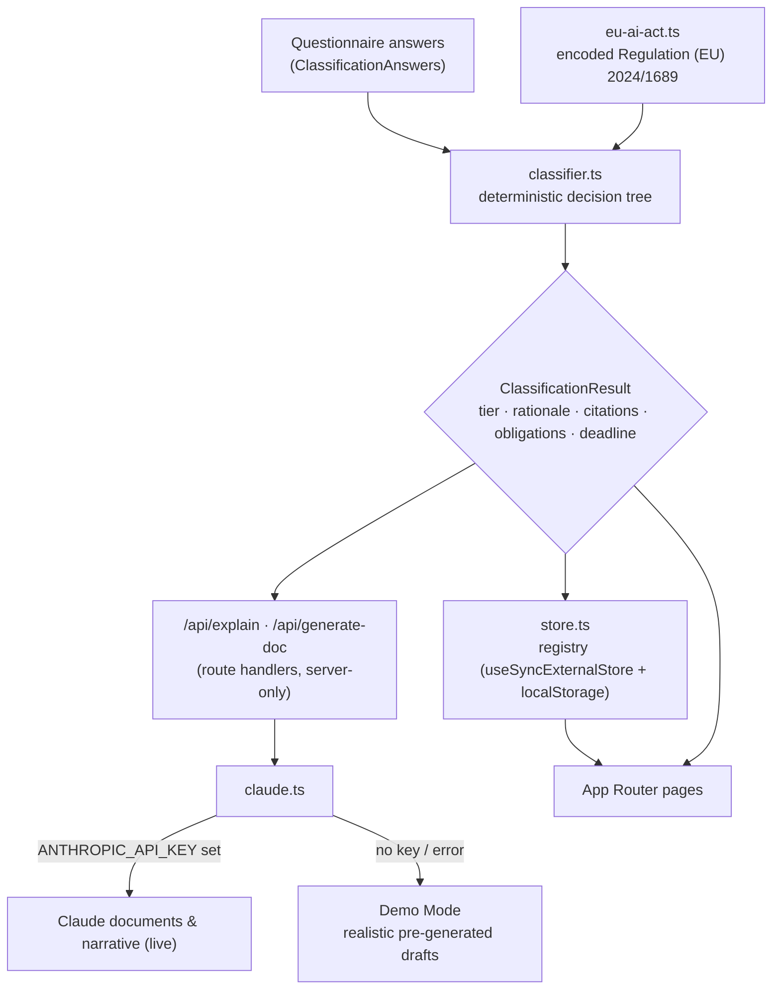

# Architecture

Conforma is a Next.js (App Router) application built around one principle: **the
regulation is a single, typed source of truth**, consumed by a deterministic engine,
with AI strictly layered on top and never able to override a cited legal conclusion.

## Layers



### 1. The regulation — `src/lib/eu-ai-act.ts`

Regulation (EU) 2024/1689 is encoded as typed, citable data structures rather than
prose:

- `RISK_TIERS` — the four tiers and their UI metadata.
- `PROHIBITED_PRACTICES` — Art. 5 bans.
- `ANNEX_III_AREAS` — the eight high-risk use-case areas.
- `HIGH_RISK_OBLIGATIONS`, `DEPLOYER_OBLIGATIONS`, `TRANSPARENCY_OBLIGATIONS`,
  `GPAI_OBLIGATIONS` — Chapter III / Art. 50 / Art. 53+ duties, tagged by role.
- `COMPLIANCE_DEADLINES` — the Art. 113 staged application timeline.
- `PENALTIES` — Art. 99 ceilings.
- Pure helpers: `obligationsForTier()`, `daysUntil()`.

Every other module reads from here, so a regulatory correction is made in exactly
one place.

### 2. The engine — `src/lib/classifier.ts`

A pure function `classify(answers): ClassificationResult` walks a decision tree in
strict priority order:

```
prohibited (Art. 5)  >  high (Annex I)  >  high (Annex III)  >  limited (Art. 50)  >  minimal
```

It accumulates a `rationale` array where each point carries the Article/Annex that
justifies it, derives the applicable obligations and deadline, and assigns a
confidence score. It is **deterministic and runs fully offline** — the same answers
always produce the same cited result, which is what makes the output auditable.

### 3. The AI layer — `src/lib/claude.ts`

A **server-only** module (imported exclusively from route handlers) that drafts
documents and plain-language narratives with Claude (`claude-opus-4-8`). It is a
pure enhancement:

- When `ANTHROPIC_API_KEY` is set, it calls the Anthropic SDK (live drafting).
- When the key is absent **or** a request fails, it switches to **Demo Mode** and
  returns realistic, system-specific pre-generated AI documents.

Each response is tagged with a `source` (`"claude"` or `"demo"`), and a
`GET /api/ai-status` endpoint exposes the current mode so the UI can show a Demo
Mode indicator proactively. Either way the workflow completes, so the product is
demo-able with zero credentials and never breaks on a transient API error. The AI
never recomputes the risk tier — it only explains or documents the tier the engine
already produced.

### 4. Persistence — `src/lib/store.ts` (dual backend)

The registry is exposed through a small **external store** consumed with React's
`useSyncExternalStore`, with two interchangeable backends selected at runtime:

- **Demo Mode** — the browser's `localStorage`, seeded with realistic demo data.
- **Production Mode** — the RLS-scoped **Supabase browser client**, with an
  optimistic cache, tenant-bounded by the active organization.

`useSystems()` / `useSystem(id)` are SSR-safe reactive reads (server snapshot is
`null` → no hydration mismatch); mutations persist and notify subscribers so the
UI updates without manual refetching. `SessionProvider` calls
`configureRegistryBackend` to flip the backend when a session resolves — consumers
never branch on mode.

### 5. The UI — `src/app/` and `src/components/`

Next.js App Router pages: the marketing surface (`/`, `/pricing`, `/security`,
`/demo`, legal), the product (`/classify`, `/dashboard`, `/systems/[id]`,
`/report`), and two API routes. SEO is first-class: per-route metadata, a generated
Open Graph image, JSON-LD, `robots.ts` and `sitemap.ts`.

## Why these choices

| Decision | Rationale |
| --- | --- |
| Regulation as typed data | One auditable source; the engine, checklist and docs can never drift apart. |
| Deterministic engine, AI on top | Reproducible, traceable results; AI augments but never decides. |
| Server-only AI module | The API key stays out of the client bundle entirely. |
| External-store persistence | SSR-safe client state today; a clean seam for a real database tomorrow. |
| Graceful Demo Mode fallback | The product works — and demos — with no credentials and survives API errors, returning realistic pre-generated drafts instead of errors. |

## Production Mode: backend, auth, tenancy, billing

Everything above works with zero credentials (Demo Mode). Supplying environment
variables activates a full multi-tenant SaaS on the **same codebase** — the switch
is centralized in `isSupabaseConfigured()` / `isStripeConfigured()`.

- **Database + RLS** — Supabase Postgres. Every table has Row Level Security;
  tenant isolation is enforced *in the database*, verified by `npm run verify:rls`.
  See [DATABASE.md](./DATABASE.md).
- **Auth** — Supabase Auth (email/password, verification, reset). Sessions are
  refreshed in `proxy.ts`; routes are guarded by the proxy + `AppGuard`.
- **Tenancy** — `organizations` + `org_members` (owner/admin/member). All data is
  scoped by `org_id`; the active org lives in a cookie and `getActiveContext`.
- **Billing** — Stripe (Free/Pro/Team). Subscriptions are Stripe-owned and
  projected into the DB by a signature-verified webhook; plan limits are enforced
  by a DB trigger. See the Billing section of [DATABASE.md](./DATABASE.md).
- **Team** — token-based invitations + member management, with an append-only
  audit log surfaced as an activity timeline.
- **Ops** — structured logging, `captureError`, `/api/health`, provider-agnostic
  analytics. See [OPERATIONS.md](./OPERATIONS.md).

## Request flow: generating a document

1. The user opens a saved system and clicks a document type.
2. The client POSTs the `ClassificationResult` to `/api/generate-doc`.
3. The route handler calls `generateDocument()` in `claude.ts`.
4. With a key, Claude drafts system-specific Markdown; without one (Demo Mode), a
   realistic pre-generated draft is returned. The response is tagged with its
   `source` (`"claude"` / `"demo"`) so the UI can show provenance.
